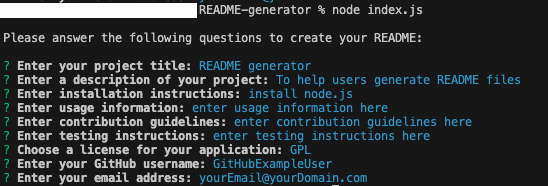
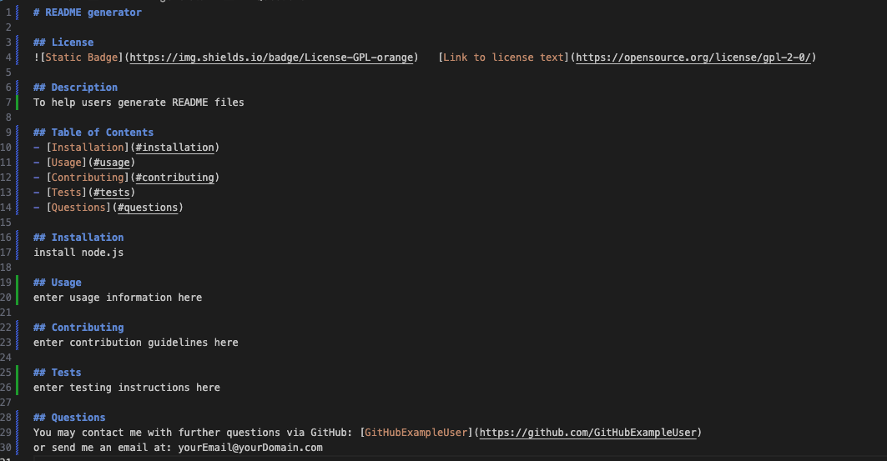

# README Generator

## Technology Used 

| Technology Used         | Resource URL           | 
| ------------- |:-------------:| 
| HTML    | [https://developer.mozilla.org/en-US/docs/Web/HTML](https://developer.mozilla.org/en-US/docs/Web/HTML) | 
| CSS     | [https://developer.mozilla.org/en-US/docs/Web/CSS](https://developer.mozilla.org/en-US/docs/Web/CSS)      |   
| Javascript | [https://developer.mozilla.org/en-US/docs/Web/JavaScript](https://developer.mozilla.org/en-US/docs/Web/JavaScript)     |    
| Node.js | [https://nodejs.org/en/docs](https://nodejs.org/en/docs)     |  
| Inquirer.js | [https://www.npmjs.com/package/inquirer](https://www.npmjs.com/package/inquirer)     |  
| Shields.io | [https://shields.io](https://shields.io)     |
| Git | [https://git-scm.com/](https://git-scm.com/)     |    

## Description 

This is a simple README generator that generates the markdown for a README file for a user based on their input to a series of questions. The user is prompted through the command line to provide data regarding the title their project, project description, installation instructions, usage, license, contributions, test information, and contact information. 

The application will generate the README.md file using markdown and will also include a badge for the chosen license as well as a link to the license text.


## Video Demo


## Command line input


## Markdown Output


## Installation 

This application uses Node.JS, please install Node.js and initialize the applicaiton by running "% node index.js" from the command line within the root directory.

## Learning Points 

This project was a great exercise in Node.js and writing to files. This also reinforced my knowledge of using markdown in README files.

## Author Info
### Links

```md
* [LinkedIn](https://www.linkedin.com/in/rossfahan)
* [Github](https://github.com/RossFahan)
```


## Credits

Referenced the following:
* [W3schools](https://www.w3schools.com/)
* [Mozilla Developer Network (MDN)](https://developer.mozilla.org/)
* [StackOverflow](https://stackoverflow.com)

## License

MIT License

Copyright (c) [2023] [Ross Fahan]

Permission is hereby granted, free of charge, to any person obtaining a copy
of this software and associated documentation files (the "Software"), to deal
in the Software without restriction, including without limitation the rights
to use, copy, modify, merge, publish, distribute, sublicense, and/or sell
copies of the Software, and to permit persons to whom the Software is
furnished to do so, subject to the following conditions:

The above copyright notice and this permission notice shall be included in all
copies or substantial portions of the Software.

THE SOFTWARE IS PROVIDED "AS IS", WITHOUT WARRANTY OF ANY KIND, EXPRESS OR
IMPLIED, INCLUDING BUT NOT LIMITED TO THE WARRANTIES OF MERCHANTABILITY,
FITNESS FOR A PARTICULAR PURPOSE AND NONINFRINGEMENT. IN NO EVENT SHALL THE
AUTHORS OR COPYRIGHT HOLDERS BE LIABLE FOR ANY CLAIM, DAMAGES OR OTHER
LIABILITY, WHETHER IN AN ACTION OF CONTRACT, TORT OR OTHERWISE, ARISING FROM,
OUT OF OR IN CONNECTION WITH THE SOFTWARE OR THE USE OR OTHER DEALINGS IN THE
SOFTWARE.


© 2023 edX Boot Camps LLC. Confidential and Proprietary. All Rights Reserved.
